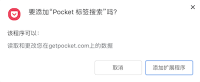
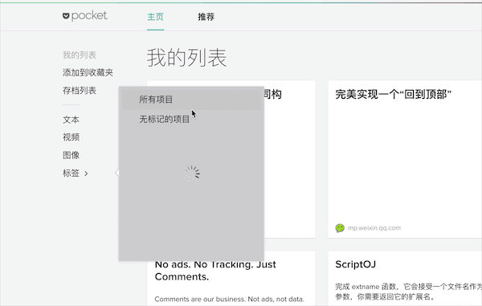

# Pocket 标签搜索拓展插件

本插件用于拓展[https://getpocket.com](https://getpocket.com) 标签模糊搜索功能。

> PS:由于基础版的 pocket 账户并不支持标签搜索功能。😂

## 使用说明
1. [下载](https://github.com/hiyangguo/chrome-pocket-tag-search-plugin/releases/download/untagged-637fd7c0fbca2e577ddd/chrome-pocket-tag-search-plugin.crx)
2. 在地址栏中访问 [chrome://extensions/](chrome://extensions/)
3. 将下载好的文件拖入浏览器中，并点击 `添加拓展程序` 按钮。

## 效果预览

